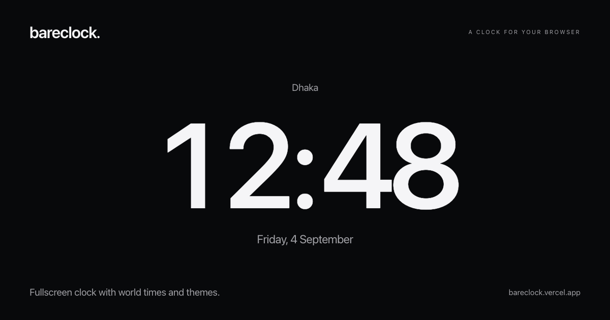

# bareclock

A clock for your browser. Open a tab, pick a face, and go fullscreen.

[bareclock.vercel.app](https://bareclock.vercel.app) · [Report a bug](https://github.com/rajin-khan/bareclock/issues/new?template=bug_report.md) · [Contribute](CONTRIBUTING.md)

## Features

- Eight clock faces: Simple, Flip, Digital, Dial, Stack, Halo, Horizon, and World.
- 24 themes, including Dracula, Catppuccin, Nord, and Rosé Pine, plus custom colors.
- World clocks with search across 235,669 cities and towns. Choose Compact or Large tiles. Click a world clock to swap it with the main clock.
- Adjustable size, digit weight, date display, seconds, and 12- or 24-hour time.
- Fullscreen, optional screen wake lock, and layouts for desktop and mobile.
- Offline use after the first successful load. The full city directory is available offline after you load it once.

Settings stay in your browser. No accounts, analytics, external fonts, or time API. The clock uses your device's time and the browser's timezone rules.

## Controls

| Key | Action |
| --- | --- |
| `F` | Toggle fullscreen |
| `S` | Open settings |
| `W` | Toggle world clocks, or open the city picker if none are saved |
| `Escape` | Close the current dialog or exit fullscreen |

Remove a world clock with the × on its tile. Reorder clocks in Settings. The question mark opens the introduction again.

## Contributing

bareclock is open source and built with plain HTML, CSS, and JavaScript. There is no framework, build step, or dependency installation. Keeping the clock small and easy to use is part of the project.

Bug fixes, accessibility improvements, browser compatibility fixes, and thoughtful UI refinements are welcome. Please open an issue before starting a new face or a larger feature.

See the [contributor guide](CONTRIBUTING.md) for setup and pull requests. The [architecture notes](docs/architecture.md), [browser checklist](docs/testing.md), and [theme sources](docs/themes-and-brand.md) cover the implementation. Automated checks run on Node.js 22 and 24.

For vulnerabilities, use [private security reporting](https://github.com/rajin-khan/bareclock/security/advisories/new). See [SECURITY.md](SECURITY.md).

## Browser support

Modern browsers are the supported baseline. Fullscreen and screen wake lock depend on browser and device support. Offline storage can be cleared or evicted by the browser. Time accuracy depends on your device clock.

## License and credits

Original code and assets are [MIT licensed](LICENSE). Bundled third-party materials retain their own terms:

- [GeoNames city data](data/README.md): CC BY 4.0.
- [La Belle Aurore](assets/fonts/SOURCES.md) by Kimberly Geswein: SIL Open Font License 1.1.
- [Natural Earth map data](assets/SOURCES.md): public domain.
- [Community palette sources](docs/themes-and-brand.md) and [clock-face design references](docs/watch-face-research.md).

Made by [Rajin Khan](https://rajinkhan.com).
